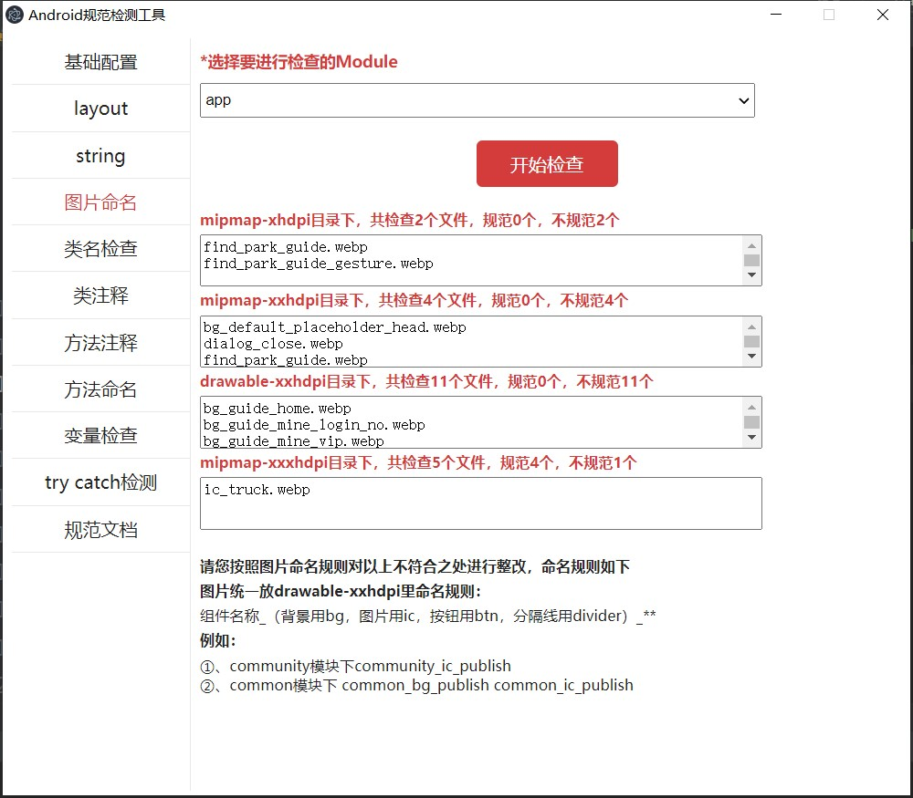

# AndroidStandard

Android可视化规范检查工具，包含基本的，类，方法，注释，资源等功能检查，大家可以根据项目需求，进行更改。

#### 功能展示


#### 环境搭建

##### 1、安装 Node.js，如果已经安装，可直接第2步：

```
Node.js中允许使用 JavaScript 开发服务端以及命令行程序，我们可以去官网https://nodejs.org下载最新版本的安装程序，然后一步一步进行安装就可以了。

```

##### 2、down下项目后，在当前目录下执行以下命令：
```
npm install --save-dev electron 或者安装制定版本 npm install --save-dev electron@^15.0.0
```

##### 3、在当前项目目录下，执行以下命令：

```
npm i -D @electron/remote

```

##### 4、启动项目：

```
npm start

```

#### 指导建议

大家可以下载WebStorm开发工具，导入项目，打开package.json文件，点击start左侧绿色按钮进行运行，后续直接右上角运行就可以了，或快捷键shift+f10，非常方便。

#### 欢迎关注我的微信公众号：微信搜一搜：Android干货铺，(或扫一扫下面的二维码)<br/>
<br/>


